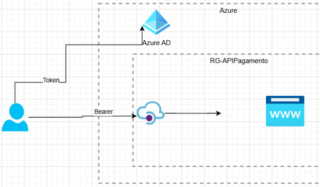

# api-segura-azure

Exercicio da DIO - API de Pagamento Segura com Azure API Management

Visão geral:

Etapas:

1. No Azure, cria-se e publica-se uma API simples (Criando App Services)

-------------------------------

2. Boas práticas de endpoints

iniciar o nome da api com x- (para tudo o que não seja padrão da api)

-------------------------------

3. Criando autenticação com JWT

- Finalidade é a criação de camada adicional de segurança.

- Registra-se uma aplicação

- Anotar as info:

